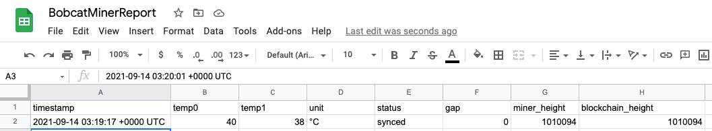

# bobcat-status-reporter
Report Bobcat Status to Google Sheets

## Why?
I recently relocated my miner from my root into the attic. Bobcat recommends operating
temperature be below 60C. I just wanted to make sure the temp did not exceed that.

## Requirements
- Python 3.8 or above
- Bobcat Miner
- Google Sheets API Service Account

## Setup Environment
- Install Requirements ```pip install -r requirements.txt```

## Arguments
```shell

Usage: report_miner_status.py [OPTIONS] MINER_IP_ADDRESS
                              GOOGLE_SHEETS_CREDENTIALS_FILE_PATH
                              GOOGLE_SHEET_ID

Arguments:
  MINER_IP_ADDRESS                [required]
  GOOGLE_SHEETS_CREDENTIALS_FILE_PATH
                                  [required]
  GOOGLE_SHEET_ID                 [required]

Options:
  --worksheet-id INTEGER
  --clear-worksheet / --no-clear-worksheet
                                  [default: False]
  --help                          Show this message and exit.
```

## Usage
```python3 
python report_miner_status.py 192.168.50.155 ./.credentials/bobcat-miner-service-account.json BobcatMinerReport
```
I would set this up as a cronjob and run it every minute.
- Crontab for *nix systems
- Task Scheduler for Windows

## Example Output
- Google Sheets


## Future Features
- Alert via Text Message if exceed temp threshold